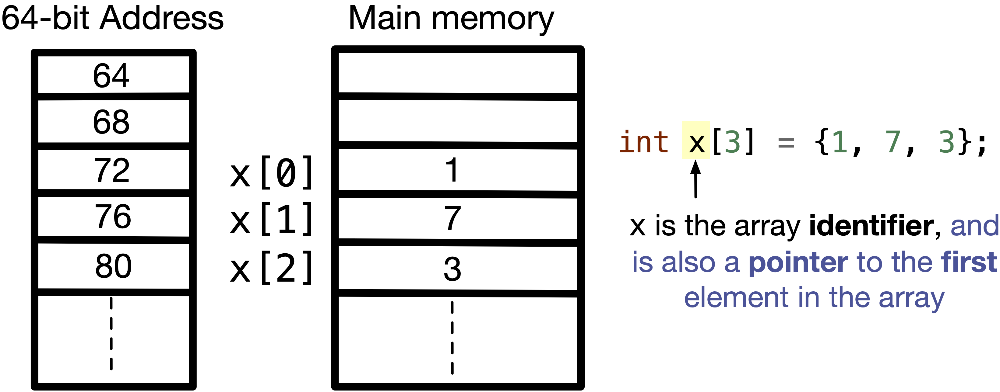
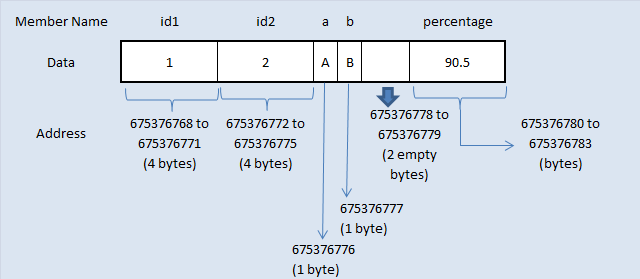

# Cours d'introduction à l'algorithmie et aux structure de données

## Comment faire ce cours ?

Il y a 3 moyen de suivre ce cours :
- En expérimentant sur [Online GDB](https://www.onlinegdb.com/online_c_compiler) (recommandé si pas le temps ou si on ne veut pas se prendre la tête)
- Via code block et en l'installant avec la version `codeblock-20.02mingw-setup.exe` [lien](https://www.codeblocks.org/downloads/binaries/)
- Via VsCode et un compilateur installé à coté : 
  - [MinGW](https://code.visualstudio.com/docs/cpp/config-mingw#_prerequisites)
  - [VsCode](https://code.visualstudio.com)

> Pour les dev je recommande de passer via vscode et d'installer la WSL windows puis de passer par Linux et d'utiliser gcc pour la compilation.


# Compilation

La compilation est le process qui va transformer votre code C en code machine (x86), pour réaliser la compilation on besion d'un compilateur. C'est à cette étape qu'on peut avoir directement les premières erreurs ou alertes qui nous sont remontées.

# Les blocks de bases

## Les variables

En C, une variable est un espace mémoire nommé utilisé pour stocker des valeurs. Avant d'utiliser une variable, vous devez la déclarer en spécifiant son type et son nom. Voici quelques exemples de déclarations de variables :

```C
int entier = 10;       // Déclaration d'une variable entière
float reel = 3.14;     // Déclaration d'une variable réelle
char caractere = 'A';  // Déclaration d'une variable caractère
```


Une fois déclarées, les variables peuvent être manipulées à l'aide d'opérateurs. Les opérateurs les plus courants sont les opérateurs arithmétiques (+, -, *, /, %), les opérateurs de comparaison (==, !=, <, >, <=, >=), et les opérateurs logiques (&&, ||, !).

```C
int a = 5;
int b = 3;
int somme = a + b;  // somme vaut 8
int produit = a * b; // produit vaut 15


bool c = true;
bool d = c && false;
```

En C, la déclaration d'une variable consiste à informer le compilateur de l'existence et du type de la variable, sans nécessairement allouer de l'espace mémoire pour celle-ci. Par exemple, extern int variable; déclare une variable entière sans l'initialiser. En revanche, la définition d'une variable non seulement déclare son type mais aussi alloue de l'espace mémoire pour elle, et peut également l'initialiser. Par exemple, int variable = 10; définit une variable entière et lui attribue la valeur 10. En résumé, la déclaration introduit le nom et le type de la variable, tandis que la définition crée effectivement la variable en mémoire.

```C
float price; // Déclaration de la variable price sans initialisation;
price = 9.95f; // Définition de la variable price

float reduction = 0.20f; // Déclaration et définition => initialisation de reduction;
```

Voici un tableau récapitulatif des principaux types de données en C, avec leurs tailles typiques et leurs plages de valeurs :

| Type de donnée | Taille (en octets) | Plage de valeurs |
|----------------|--------------------|------------------|
| `char`         | 1                  | -128 à 127 (signé) ou 0 à 255 (non signé) |
| `unsigned char`| 1                  | 0 à 255          |
| `short`        | 2                  | -32,768 à 32,767 (signé) |
| `unsigned short`| 2                | 0 à 65,535       |
| `int`          | 4                  | -2,147,483,648 à 2,147,483,647 (signé) |
| `unsigned int` | 4                  | 0 à 4,294,967,295|
| `long`         | 4 ou 8             | -2,147,483,648 à 2,147,483,647 (signé, 4 octets) ou -9,223,372,036,854,775,808 à 9,223,372,036,854,775,807 (signé, 8 octets) |
| `unsigned long`| 4 ou 8           | 0 à 4,294,967,295 (4 octets) ou 0 à 18,446,744,073,709,551,615 (8 octets) |
| `long long`    | 8                  | -9,223,372,036,854,775,808 à 9,223,372,036,854,775,807 (signé) |
| `unsigned long long` | 8         | 0 à 18,446,744,073,709,551,615 |
| `float`        | 4                  | Environ 1.2E-38 à 3.4E+38 |
| `double`       | 8                  | Environ 2.3E-308 à 1.7E+308 |
| `long double`  | 10 ou 16           | Environ 3.4E-4932 à 1.1E+4932 |

#### Notes :
- Les tailles des types peuvent varier en fonction de l'architecture et du compilateur utilisé. Les tailles indiquées ci-dessus sont typiques pour les systèmes 16 bits, 32 bits et 64 bits. (/!\ si vous faites de l'embarqué /!\ )
- Les types `char`, `short`, `int`, `long`, et `long long` peuvent être signés ou non signés. Par défaut, ils sont signés, mais on peut utiliser le mot-clé `unsigned` pour les rendre non signés.
- Les types flottants (`float`, `double`, `long double`) sont utilisés pour représenter des nombres à virgule flottante avec différentes précisions. Les opérations entre nombre flottans peuvent ammener à des problèmes de précision. [Explications](https://learn.microsoft.com/fr-fr/cpp/build/why-floating-point-numbers-may-lose-precision?view=msvc-170)

#### Exercices :

Choisir le bon type de variable pour chaque donnée qu'on souhaite modéliser : 
- Le nombre d'individu d'une espece donnée
- Une distance entre 2 points
- L'état de marche d'une lampe
- Un prix
- L'état d'ouverture d'une porte.

Faire un programme qui echange les 2 v

## Les structures de controles

Les structures de contrôle permettent de diriger le flux d'exécution d'un programme. Les structures de contrôle les plus courantes sont les instructions conditionnelles (if, else) et les boucles (for, while).

### Instructions conditionnelles

Les instructions conditionnelles permettent d'exécuter un bloc de code uniquement si une condition est vraie.

```C
int nombre = 10;

if (nombre > 0) { // Ici on place la condition logique
    printf("Le nombre est positif.\n");
} else {
    printf("Le nombre est négatif ou nul.\n");
}
```

### Boucles

Les boucles permettent de répéter un bloc de code plusieurs fois.

- **Boucle `for`** : Utilisée lorsque le nombre d'itérations est connu à l'avance.

```C
for (int i = 0 /* Initialisation de l'itérateur*/; i < 5 /* condition d'itération */; i++ /* foncion exécutée à la fin de chaquee iération*/) {
    printf("Itération %d\n", i);
}
```

- **Boucle `while`** : Utilisée lorsque le nombre d'itérations n'est pas connu à l'avance.
```C
int i = 0;
while (i < 5>) {
    printf("Itération %d\n", i);
    i++;
}
```

- **Boucle `do ... while`** : Similaire à la boucle `for` elle est différente du fait qu'elle exécute à minima une fois le corps de la boucle, avnat de vérifier les condition d'itération;

```C
int i = 0;
do {
    printf("Itération %d\n", i);
    i++;
} while (i < 5);
```

> Il existe le mot clef `continue` dans bon nombre de langage de programmation qui permet de d'interompre l'itération en cours. Etil existe le mot clef `break` qui permet de sortir de la boucle  itérative.

### Exercice :

## Exercice : Calcul des intérêts d'un prêt

**Objectif** :  Utiliser les boucles logiques pour estimer la valeur d'un investissement en fonction d'un taux de croissance mensuel, du nombre de mois et de l'investissement mensuel.

**Énoncé** :

Vous devez écrire un programme en C qui calcule la valeur totale d'un investissement après un certain nombre de mois. Le programme doit demander à l'utilisateur de saisir le montant initial de l'investissement, le taux de croissance mensuel (en pourcentage), le nombre de mois et le montant de l'investissement mensuel supplémentaire. Le programme affichera ensuite la valeur totale de l'investissement à la fin de chaque mois.

**Exemple** :
- Montant initial : 1000 €
- Taux d'intérêt mensuel : 1%
- Nombre de mois : 12
- Investissemen mensuel : 100€

**Résultat attendu** :
Mois 1 : 1101 €
Mois 2 : 1203.01 €
...

**Consignes** :
1. Utilisez une boucle for ou while pour calculer la valeur totale de l'investissement chaque mois.
2. Affichez la valeur totale de l'investissement à la fin de chaque mois.
3. Assurez-vous que le programme gère correctement les entrées de l'utilisateur.

**Squelette du programme** :

```c
#include <stdio.h>
#include <math.h>

int main() {
    double montantInitial, tauxCroissance, investissementMensuel, valeurTotal;
    int nombreMois;

    // Demander les informations à l'utilisateur
    printf("Entrez le montant initial de l'investissement : ");
    scanf("%lf", &montantInitial);
    printf("Entrez le taux de croissance mensuel (en pourcentage) : ");
    scanf("%lf", &tauxCroissance);
    printf("Entrez le nombre de mois : ");
    scanf("%d", &nombreMois);
    printf("Entrez le montant de l'investissement mensuel : ");
    scanf("%lf", &investissementMensuel);

    // A completer

    return 0;
}
```

## Les fonctions

Les fonctions permettent de regrouper des instructions dans un bloc réutilisable. Une fonction est définie par un nom, un type de retour, et une liste de paramètres.

```C
// Définition de la fonction
int addition(int a, int b) {
    return a + b;
}

// Appel de la fonction
int resultat = addition(3, 4); // resultat vaut 7

```

### Les paramêtre de fonction

Les fonctions en C peuvent prendre des paramètres, qui sont des valeurs passées à la fonction lors de son appel. Les paramètres permettent de rendre les fonctions plus flexibles et réutilisables.

Syntaxe de définition d'une fonction avec des paramètres :

```C
type_de_retour nom_de_la_fonction(type_param1 nom_param1, type_param2 nom_param2, ...) {
    // Corps de la fonction
}
```

**Exemple de fonction**

```C
int addition(int a, int b) {
    return a + b;
}

int main() {
    int resultat = addition(3, 4); // resultat vaut 7
    printf("Résultat : %d\n", resultat);
    return 0;
}
```

### La sortie d'une fonction

La sortie d'une fonction est déterminée par sa valeur de retour, spécifiée par le type de retour dans la définition de la fonction. La valeur de retour est renvoyée à l'appelant de la fonction à l'aide de l'instruction `return`.

```C
int carre(int nombre) {
    return nombre * nombre;
}

int main() {
    int resultat = carre(5); // resultat vaut 25
    printf("Carré : %d\n", resultat);
    return 0;
}
```

Dans cet exemple, la fonction carre prend un entier en paramètre et retourne son carré. La valeur de retour est utilisée dans la fonction main pour afficher le résultat.

#### Exercice 

Adapter le programme précédent en y ajoutant une fonction qui englobe la logique mise en place.

### Fonction main

Dans un programme exécutable en C une fonction est particulière cette fonction est la fonction `main`. La fonction main est le point d'entrée de tout programme en C. C'est la première fonction qui est appelée lorsque le programme est exécuté. Elle a une syntaxe spécifique et peut prendre des paramètres pour recevoir des arguments passés lors de l'exécution du programme.

```C
int main(int argc, char *argv[]) {
    // Corps de la fonction main
    return 0;
}
```

- `int argc` : Est un entier qui représente le nombre d'arguments passés au progra  mme, y compris le nom du programme lui-même.

- `char *argv[]` ou `char **argv` : Est un tableau de chaine de caractères qqui contient les arguments passés au programme. `argv[0]` contient le nom du programme, et `argv[n]` le n-ieme argument du programme.

Pour passer un argument à un programme via un invite de commande il faut : 
```bash
./my-program  first-arg second-arg
```

Voici un exemple d'utilisation de la fonction main : 
```C
#include <stdio.h>

int main(int argc, char *argv[]) {
    printf("Nombre d'arguments : %d\n", argc);
    for (int i = 0; i < argc; i++) {
        printf("Argument %d : %s\n", i, argv[i]);
    }
    return 0;
}
```

### Récursivitée

La récursivité est une technique de programmation où une fonction s'appelle elle-même pour résoudre un problème. Cette méthode est particulièrement utile pour résoudre des problèmes qui peuvent être décomposés en sous-problèmes plus petits et similaires. Une fonction récursive doit inclure une condition de base (ou cas de base) pour arrêter la récursion et éviter une boucle infinie. 

*Cas d'étude avec la factorielle*

En mathématique la facorielle d'un nombre *n* (notée **n!**) est le produit de tous les entiers positifs jusqu'à *n*. Par exemple : **5!** = 5 x 4 x 3 x 2 x 1 = 120;

Voici comment on peut définir une fonction récursive pour calculter la factorielle en C : 

```C
int factorielle(int n) {
    // Condition de base : si n est 0 ou 1, la factorielle est 1
    if (n == 0) {
        return 1;
    }

    // Appel récursif : n * factorielle de (n - 1)
    return n * factorielle(n - 1);
}
```

**Avantages et inconvénients**
- **Avantages** : La récursivité permet d'écrire des solutions élégantes et concises pour des problèmes complexes. Elle est particulièrement utile pour les problèmes naturellement récursifs.

- **Inconvénients** : La récursivité peut consommer beaucoup de mémoire en raison de la pile d'appels (call stack). Chaque appel récursif ajoute une nouvelle entrée à la pile, ce qui peut entraîner des dépassements de pile (stack overflow) pour des récursions profondes.

# Les Pointeurs

Les pointeurs sont un concept fondamental en programmation C qui permet de manipuler directement les adresses mémoire des variables. Ils offrent une grande flexibilité et sont essentiels pour des tâches telles que la gestion dynamique de la mémoire, la manipulation de tableaux et la création de structures de données complexes.

> Dans bon nombre de langage de programmation, les variables et objets manipulés ne sont en réalité que des pointeurs !

## Définition 

Un pointeur est une variable qui stocke l'adresse mémoire d'une autre variable. La déclaration d'un pointeur se fait en utilisant l'opérateur *.

```C
int* pointeur;
```

Dans cet exemple, `pointeur` est un pointeur vers un entier. Il peut stocker l'adresse d'une variable de type `int`.

Pour initialiser un pointeur, on utilise l'opérateur & (adresse de) pour obtenir l'adresse d'une variable. 

```C
int variable = 10;
int *pointeur = &variable;
printf("La valeur pointer vaut : %i", *pointeur)
```

Dans cet exemple, `pointeur` stocke l'adresse mémoire de `variable`, et rajouter l'opérateur `*` à `pointeur`  permet d'obtenir la valeur stocké dans l'addresse stocké dans `pointeur`. Cette opération s'appel communément "**pointer**" dans la programmation ou "**déréférencement**".

### Manipulation et passage par référence

Les pointeurs peuvent être utilisés pour modifier la valeur d'une variable indirectement.

```C
int variable = 10;
int *pointeur = &variable;
*pointeur = 20; // variable vaut maintenant 20
```

En C, le passage par référence est une technique qui permet à une fonction de modifier directement les variables passées en argument. Contrairement au passage par valeur, où une copie de la variable est transmise à la fonction, le passage par référence utilise des pointeurs pour accéder directement à la mémoire de la variable originale. Cette méthode est particulièrement utile lorsque vous souhaitez que les modifications effectuées dans la fonction soient reflétées dans le contexte d'appel.

**Pourquoi utiliser le passage par référence ?**

Le passage par référence est essentiel dans plusieurs situations :

- Modification de variables : Lorsque vous avez besoin qu'une fonction modifie directement les variables passées en argument.
- Efficacité : Pour éviter la copie de grandes structures de données, ce qui peut améliorer les performances du programme.
- Retour de plusieurs valeurs : Lorsque vous souhaitez qu'une fonction retourne plusieurs valeurs, vous pouvez passer des pointeurs vers les variables qui stockeront ces valeurs.


Considérons une fonction qui échange les valeurs de deux variables entières :

```C
#include <stdio.h>

void echanger(int *a, int *b) {
    int temp = *a;
    *a = *b;
    *b = temp;
}

int main() {
    int x = 5;
    int y = 10;

    printf("Avant échange : x = %d, y = %d\n", x, y);
    echanger(&x, &y);
    printf("Après échange : x = %d, y = %d\n", x, y);

    return 0;
}

```

**Explication**
1. Déclaration de la fonction echanger : La fonction prend deux pointeurs vers des entiers (int *a et int *b).
2. Utilisation des pointeurs : À l'intérieur de la fonction, les valeurs pointées par a et b sont échangées en utilisant une variable temporaire temp.
3. Appel de la fonction : Dans la fonction main, les adresses des variables x et y sont passées à la fonction echanger en utilisant l'opérateur &.
4. Résultat : Après l'appel à echanger, les valeurs de x et y sont échangées.

**Implication**

Le passage par référence permet de modifié l'état des variables de la portée (ou scope) supérieur.

#### Exercice :

Créer une fonction qui echange les valeurs de 3 variables de telle manière qu'une variable A devient B, B devient C, et C devient A.

### Pointeurs et tableaux

Les pointeurs sont étroitement liés aux tableaux en C. Le nom d'un tableau peut être utilisé comme un pointeur vers son premier élément.

```C
int tableau[5] = {1, 2, 3, 4, 5};
int *pointeur = tableau; // pointeur pointe vers le premier élément du tableau
```

Et on peut accéder aux élèments du tableau en utilisant l'arithmétique des pointeurs : 
```C
int valeur = *(pointeur + 2) // Ici la valeur vau 3
```

> En C, les tableaux possèdent la propriété que leurs éléments sont contigus en mémoire. Grâce à cette disposition, un pointeur peut être utilisé pour accéder à n'importe quel élément du tableau en se basant sur l'adresse du premier élément. 



### Allocation dynamique de la mémoire.

Les pointeurs sont essentiels pour l'allocation dynamique de mémoire, c'est-à-dire la réservation de mémoire pendant l'exécution du programme. Les fonctions `malloc` et `free` de la bibliothèque standard sont utilisées pour allouer et libérer de la mémoire dynamiquement.

> `malloc` signifie mémory allocation.

```C
#include <stdlib.h>

int *tableau = (int *)malloc(5 * sizeof(int)); // Alloue de la mémoire pour 5 entiers


// Utilisation du tableau
tableau[0] = 1;
tableau[1] = 2;

// Libération de la mémoire
free(tableau);
```

Si la mémoire n'est pas libéré, il y a alors **fuite mémoire**, la fuite mémoire est le fait que notre programme utilise de plus en plus de mémoire sans jamais être libéré. Et il arrive donc qu'au bout d'un moment le système ne possède plus assez d'espace mémoire et donc crash. (aujourd'hui le système d'exploitation qui gère la mémoire, gère très bien ce soucis, et donc au pire c'est notre programme qui crash)

Il est de plus important de noter, que l'espace mémoire allouer est un espace donner par le système d'exploitation. (Qui lui est chargé d'allouer les ressources matérielles, ou bien d'exploiter le système) Et donc, on peut se voir refuser l'accés à certains espaces mémoire car on n'y aurait pas accés. L'erreur typique dans ce cas c'est : **Out-of-Bound Access** qui justyement vient du fait que nous accés à un espace mémoire non allouer au programme.

Une autre erreur qui peut aussi arriver, est de pointer vers une valeur nulle/non définie, on a donc une erreur bien connu des développeurs : **Dereferencing a NULL Pointer** en C, ou bien **Null pointer exception** dans bon nombre d'autres langages, plus communément appeler **NPE** 

# Les structures de données de base

Les structures de données sont des méthodes spécialisées pour organiser et stocker des données de manière efficace. Elles permettent de gérer de grandes quantités de données et de réaliser des opérations complexes de manière optimale. En programmation, les structures de données sont essentielles pour résoudre des problèmes algorithmiques et pour concevoir des applications performantes. Parmi les structures de données les plus courantes, on trouve les tableaux, les listes chaînées, les piles, les files, les arbres et les graphes. Chaque structure a ses propres caractéristiques et est un outil pour la modélisation du problème traité.

## Les Structures

En C, les structures (`struct`) sont des outils puissants pour créer des types de données composites. Elles permettent de regrouper plusieurs variables de types différents sous un même nom, facilitant ainsi la gestion de données complexes.

### Définition

Une structure est un type de donnée composite qui permet de regrouper plusieurs variables de types différents. Chaque variable dans une structure est appelée un membre. Les structures sont utiles pour représenter des entités complexes, comme des points en géométrie ou des enregistrements dans une base de données.

```C
struct Point {
    int x;
    int y;
};

int main() {
    struct Point p;
    p.x = 10;
    p.y = 5;

    printf("Coordonnées du point : (%d, %d)\n", p.x, p.y);
    return 0;
}
```
Une structure peut aussi être utilisée avec un pointeur : 

```C
struct Point {
    int x;
    int y;
};

struct Point *pointeur;
pointeur = (struct Point *)malloc(sizeof(struct Point));
pointeur->x = 10;
pointeur->y = 20;

// Libération de la mémoire
free(pointeur);
```

Dans le cadre d'utilisation des pointeurs avec les structures, on passe de l'opérateur `.` à `->` pour accéder aux élèments de la structure.


Les données dans une structure sont contigus en mémoire. (A l'image des tableaux) 

```C
struct Student 
{
       int id1;
       int id2;
       char a;
       char b;
       float percentage;
};

int main() 
{
    int i;
    struct Student student = {1, 2, 'A', 'B', 90.5};
    return 0;
}
 
```



[Pour plus de détail](https://www.fresh2refresh.com/c-programming/c-structure-padding/)

> On peut très bien stocker dans une structure d'autres structures ou bien même des pointeurs vers d'autres structures.

Une structure déclare un type, mais l'usage d'une structure nécéssite l'utilisation du mot clef type. Il est possible de simplifier l'criture en C via la ligne suivante :

```C
typedef struct Point Point;
```

Pour utiliser Point il suffira de Déclarer un point de la manière suivante : 

```C
Point point;
```

au lieu de : 
```C
struct Point point;
```

#### Exercice :

Ecrire une fonction qui prend 2 points en paramêtre et qui calcul le milieu du segment ayant pour extrémité les 2 points.

## Les tableaux

En C, les tableaux sont des structures de données qui permettent de stocker une collection d'éléments de même type. Les éléments d'un tableau sont contigus en mémoire, ce qui signifie qu'ils se suivent directement les uns après les autres. Cette propriété permet d'accéder efficacement aux éléments du tableau en utilisant des pointeurs.

### Définition 

Un tableau est une collection d'éléments de même type, identifiés par des indices. Les indices commencent généralement à 0. Les tableaux sont utiles pour stocker et manipuler des séries de données, comme des listes de nombres ou des chaînes de caractères.

```C
#include <stdio.h>

int main() {
    int tableau[5] = {1, 2, 3, 4, 5};

    for (int i = 0; i < 5; i++) {
        printf("Élément %d : %d\n", i, tableau[i]);
    }

    return 0;
}

```

Dans cet exemple, un tableau de 5 entiers est déclaré et initialisé. Les éléments du tableau sont ensuite affichés à l'aide d'une boucle `for`.

### Tableaux et pointeurs

Comme vu précédemment, les tableaux et les pointeurs sont étroitement liés en C. Le nom d'un tableau peut être utilisé comme un pointeur vers son premier élément. Cela permet d'utiliser l'arithmétique des pointeurs pour accéder aux éléments du tableau.

```C
int main() {
    int tableau[5] = {1, 2, 3, 4, 5};
    int *pointeur = tableau; // pointeur pointe vers le premier élément du tableau

    for (int i = 0; i < 5; i++) {
        printf("Élément %d : %d\n", i, *(pointeur + i));
    }

    return 0;
}
```

Dans cet exemple, un pointeur est utilisé pour accéder aux éléments du tableau. L'expression `*(pointeur + i)` est équivalente à `tableau[i]`.

### Tableaux multidimensionnels

Les tableaux multidimensionnels permettent de stocker des données sous forme de matrices ou de structures plus complexes. Par exemple, un tableau à deux dimensions peut être utilisé pour représenter une grille ou une matrice.

```C
#include <stdio.h>

int main() {
    int matrice[3][3] = {
        {1, 2, 3},
        {4, 5, 6},
        {7, 8, 9}
    };

    for (int i = 0; i < 3; i++) {
        for (int j = 0; j < 3; j++) {
            printf("Élément [%d][%d] : %d\n", i, j, matrice[i][j]);
        }
    }

    return 0;
}
```

Dans cet exemple, un tableau à deux dimensions (3x3) est déclaré et initialisé. Les éléments du tableau sont ensuite affichés à l'aide de boucles imbriquées.

De plus voici comment vous pouvez utiliser des pointeurs pour accéder aux éléments d'un tableau à deux dimensions en C :

```C
#include <stdio.h>

int main() {
    int matrice[3][3] = {
        {1, 2, 3},
        {4, 5, 6},
        {7, 8, 9}
    };

    int (*pointeur)[3] = matrice; // Pointeur vers un tableau de 3 entiers

    for (int i = 0; i < 3; i++) {
        for (int j = 0; j < 3; j++) {
            printf("Élément [%d][%d] : %d\n", i, j, pointeur[i][j]);
        }
    }

    return 0;
}
```

#### Exercice : 

Écrivez une fonction qui prend en paramètre un tableau d'entiers et sa taille, et qui retourne la somme de tous les éléments du tableau.

# Les structures de données construite

## Les listes

### Introduction aux listes chaînées

Contrairement aux tableaux qui stockent des données dans des emplacements contigus en mémoire, les listes chaînées sont constituées de nœuds qui contiennent à la fois une donnée et un pointeur vers le nœud suivant. Cette structure offre plusieurs avantages significatifs.


*Voici le code d'une Node :*
```C
struct Node {
    int data;
    struct Node* next;
    struct Node* prev;
};
```

*Et voici les fonction pour manipuler une node*
```C

// Création d'un nouveau nœud
struct Node* creerNoeud(int data) {
    struct Node* nouveauNoeud = (struct Node*)malloc(sizeof(struct Node));
    nouveauNoeud->data = data;
    nouveauNoeud->next = NULL;
    return nouveauNoeud;
}

// Insertion au début de la liste
struct Node* insererDebut(struct Node* tete, int data) {
    struct Node* nouveauNoeud = creerNoeud(data);
    nouveauNoeud->next = tete;
    return nouveauNoeud;
}

// Affichage de la liste
void afficherListe(struct Node* tete) {
    struct Node* courant = tete;
    while (courant != NULL) {
        printf("%d -> ", courant->data);
        courant = courant->next;
    }
    printf("NULL\n");
}

int main() {
    struct Node* liste = NULL;
    
    // Ajout de quelques éléments
    liste = insererDebut(liste, 3);
    liste = insererDebut(liste, 2);
    liste = insererDebut(liste, 1);
    
    afficherListe(liste);
    
    return 0;
}
Dans les prochaines sections, nous explorerons les différents types de listes plus en détail et nous verrons comment implémenter des opérations complexes comme la recherche, l'insertion à une position spécifique, ou encore la suppression d'éléments.RetryClaude can make mistakes. Please double-check responses.
```

**Avantages des listes par rapport aux tableaux**
1. Taille dynamique

- **Listes** : Peuvent s'agrandir ou diminuer pendant l'exécution sans réallocation complète
- **Tableaux** : Nécessitent une réallocation et copie complète pour changer de taille

2. Efficacité des insertions et suppressions

- **Listes** : Insertion et suppression en O(1) si on connaît la position
- **Tableaux** : Nécessitent de décaler les éléments en O(n)

3. Utilisation de la mémoire

- **Listes** : Allocation précise à la demande, mais overhead dû aux pointeurs
- **Tableaux** : Peuvent réserver de l'espace inutilisé ou être insuffisants

4. Structure et organisation

- **Listes** : Structure non-contiguë avec des nœuds reliés par des pointeurs
- **Tableaux** : Structure contiguë avec accès direct par indice

#### Exercice pratique

Implémenter une fonction qui inverse une liste chaînée :

### Introduction aux vecteurs

Le vecteur est une implémentation de tableau dynamique qui combine les avantages des tableaux (accès rapide par indice) et des listes (taille dynamique). C'est une structure de données fondamentale dans de nombreux langages de programmation modernes (comme `std::vector` en C++, `ArrayList` en Java, ou `list` en Python).

Un vecteur est essentiellement un tableau qui peut changer de taille automatiquement. Voici comment on pourrait l'implémenter en C :

```C
typedef struct {
    int* elements;     // Tableau d'éléments
    int taille;        // Nombre d'éléments utilisés
    int capacite;      // Capacité totale allouée
} Vector;
```

**Initialisation** 

```C
Vector* initialiserVector() {
    Vector* vec = (Vector*)malloc(sizeof(Vector));
    vec->capacite = 10;  // Capacité initiale
    vec->taille = 0;     // Aucun élément au début
    vec->elements = (int*)malloc(vec->capacite * sizeof(int));
    return vec;
}
```
**Redimensionnement**

```C
void redimensionner(Vector* vec, int nouvelleCapacite) {
    int* nouveauxElements = (int*)malloc(nouvelleCapacite * sizeof(int));
    
    // Copier les éléments existants
    for (int i = 0; i < vec->taille; i++) {
        nouveauxElements[i] = vec->elements[i];
    }
    
    // Libérer l'ancien tableau et mettre à jour
    free(vec->elements);
    vec->elements = nouveauxElements;
    vec->capacite = nouvelleCapacite;
}
```

**Ajout d'éléments**
```C
void ajouter(Vector* vec, int element) {
    // Vérifier si redimensionnement nécessaire
    if (vec->taille == vec->capacite) {
        redimensionner(vec, vec->capacite * 2);  // Doubler la capacité
    }
    
    // Ajouter l'élément et incrémenter la taille
    vec->elements[vec->taille] = element;
    vec->taille++;
}
```

**Insertion à une position**

```C
void inserer(Vector* vec, int position, int element) {
    // Vérifier si la position est valide
    if (position < 0 || position > vec->taille) {
        printf("Position d'insertion invalide\n");
        return;
    }
    
    // Redimensionner si nécessaire
    if (vec->taille == vec->capacite) {
        redimensionner(vec, vec->capacite * 2);
    }
    
    // Décaler les éléments pour faire de la place
    for (int i = vec->taille; i > position; i--) {
        vec->elements[i] = vec->elements[i-1];
    }
    
    // Insérer l'élément et incrémenter la taille
    vec->elements[position] = element;
    vec->taille++;
}
```

**Avantages des vecteurs**
1. **Accès aléatoire efficace** : O(1) comme les tableaux classiques
2. **Taille dynamique** : S'adapte automatiquement aux besoins
3. **Amortissement des coûts** : Les opérations d'ajout sont en O(1)
4. **Utilisation optimale de la mémoire** : Bon compromis entre sur-allocation et réallocation fréquentes.

**Inconvénients des vecteurs**
1. **Réallocation coûteuse** : Quand la capacité est atteinte, la réallocation en O(n)
2. **Insertions/suppressions en milieu inefficaces** : Nécessitent de décaler les éléments en O(n)
3. **Gestion manuelle de la mémoire** : En C, contrairement aux langages de plus haut niveau

### Comparaison avec mes tableaux et les listes

| Critère | Vecteur | Tableau | Liste |
|---------|---------|---------|-------|
| Accès par indice | O(1) | O(1) | O(n) |
| Insertion/suppression au début | O(n) | O(n) | O(1) |
| Insertion/suppression à la fin | O(1)* | O(1) | O(1)** |
| Insertion/suppression au milieu | O(n) | O(n) | O(n) |
| Utilisation mémoire | Efficace | Statique | Overhead |
| Taille dynamique | Oui | Non | Oui |

\* Amorti, peut être O(n) en cas de réallocation  
\** Avec pointeur vers la fin

Cette structure de données offre un excellent compromis pour de nombreuses applications où la flexibilité des listes et les performances des tableaux sont nécessaires.

## Les graphes

## Les arbres

## ### Les maps ou table de hachage

# Les algorithmes de tri

## Définition et propriétées

## Trie à bulle

## Tri rapide

## Tri fusion

# Annexe :
## Comment afficher du text et prendre une entrée.

## C'est quoi une metadata

## Le cas du pointeur générique


